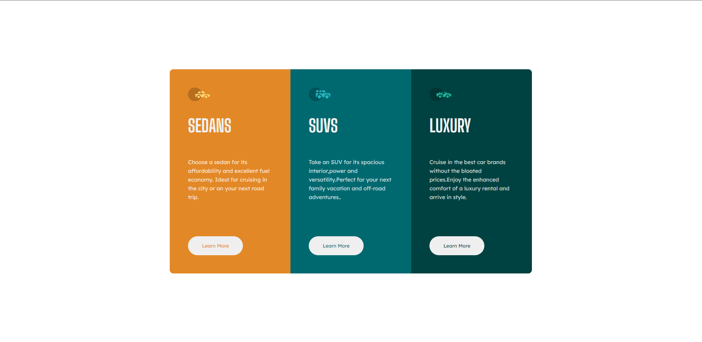

# Frontend Mentor - 3-column preview card component solution

This is a solution to the [3-column preview card component challenge on Frontend Mentor](https://www.frontendmentor.io/challenges/3column-preview-card-component-pH92eAR2-). Frontend Mentor challenges help you improve your coding skills by building realistic projects. 

## Table of contents

- [Overview](#overview)
  - [The challenge](#the-challenge)
  - [Screenshot](#screenshot)
  - [Links](#links)
- [My process](#my-process)
  - [Built with](#built-with)
  - [What I learned](#what-i-learned)
  - [Useful resources](#useful-resources)
- [Author](#author)

**Note: Delete this note and update the table of contents based on what sections you keep.**

## Overview

### The challenge

Users should be able to:

- View the optimal layout depending on their device's screen size
- See hover states for interactive elements

### Screenshot
###### Desktop	

###### Mobile

### Links

- Solution URL: [Github URL](https://github.com/Faraz-mobin17/3-Column-Layout)
- Live Site URL: [Live site URL here](https://quizzical-beaver-cfc78b.netlify.app)

## My process

### Built with

- Semantic HTML5 markup
- CSS custom properties
- Flexbox
- Mobile responsive

### What I learned

This project has helped me to recall use of flexbox to design a responsive layout.

### Useful resources

- [W3schools](https://www.w3schools.com) - This helped me for to recall use of flexbox. 

## Author

- Website - [Add your name here](https://www.your-site.com)
- Frontend Mentor - [@Faraz-mobin17](https://www.frontendmentor.io/profile/Faraz-mobin17)
- Twitter - [@Faraz_mobin](https://twitter.com/Faraz_mobin)

